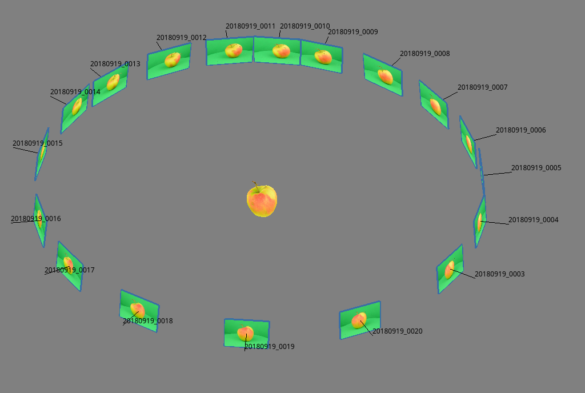
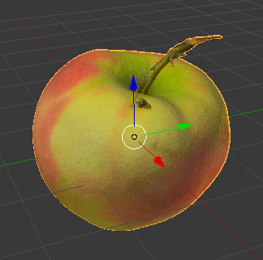
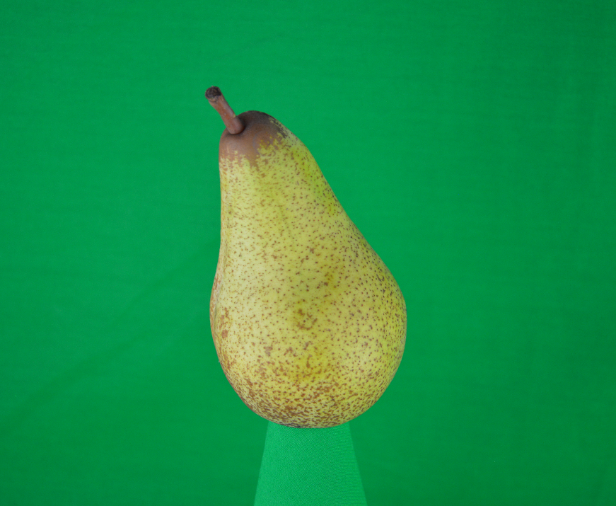
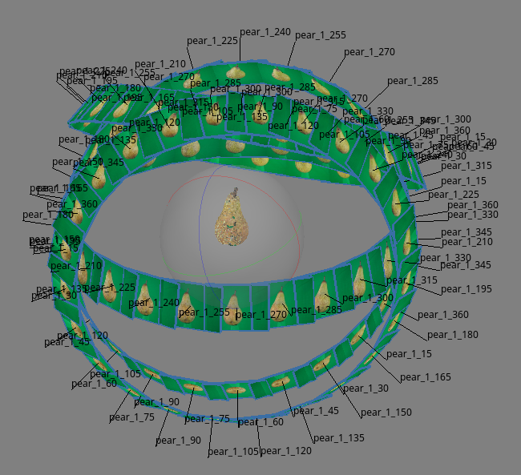

# 3DScanner
Automated process of shooting photos and rotate a turntable/lazysusan to get images in a 360°/steps view. A 3D object can then be generated with a photogrammetry tool such as Agisoft PhotoScan/Metashape. 

## What is this for?

This repo contains code an information to setup an automated turntable to make photos in certain steps once around an object.
Its especially usefull for photogrammetry tasks where you'll need lots of photos once anround an object. With the option of multiple photo positions and a background photo, the workflow is opimized to work with photogrammetry tools like Agisofts PhotoScan/Metashape.

So you can create images like this: \


Which can be further processed to:\
  


## Getting Started

These instructions will get you a copy of the project up and running on your local machine for development and testing purposes.

### Prerequisites

Needed Hardware and its setup is described below. The system is expected to be Linux (just tested with Linux Mint 18.3).

#### Hardware

- Stepper Motor (Longruner NEMA 17, Bipolar Stepper Motor Driver, 1.7 A/24 V 42x40 mm Body, 4 Lead Stepper Motor & 32 Segments 4A 40V 57/86 Stepper Motor Driver LD09) \
https://www.amazon.de/gp/product/B07FKJK1H9/ref=ppx_yo_dt_b_search_asin_title?ie=UTF8&language=en_GB&psc=1
- Power supply (e.g. 90W Universal Laptop Notebook power supply 90w -240v AC 50/60hz output voltage 15v,Output 5amps Max)\
https://www.amazon.de/gp/product/B00LATEQ7I/ref=ppx_yo_dt_b_search_asin_title?ie=UTF8&psc=1
- USB-A to USB-B Kable for PC connection
- Camera with serial interface and cabel (e.g. NikonD3200)

#### Hardware setup

Setup as described in:
https://www.hackster.io/ashleyblack/tb6600-stepper-motor-driver-tester-85a29e

Except of 
1. That I used an Arduino UNO and therfore the code **[/main/TB6600_Step_Driver.ino](/main/TB6600_Step_Driver.ino)** changed.
2. The wiring of the driver stage is changing accordingly: \
**_ENA-_** --- to ---	ArduinoUNO  **_GND_** \
**_ENA+_** --- to ---	ArduinoUNO  **_Pin2** \
**_DIR-_** --- to ---	ArduinoUNO  **_GND** \
**_DIR+_** --- to ---	ArduinoUNO  **_Pin3** \
**_PUL-_** --- to ---	ArduinoUNO  **_GND** \
**_PUL+_** --- to ---	ArduinoUNO  **_Pin4** \
**_B-_** --- to ---	StepperMotor  **_black** \
**_B+_** --- to ---	StepperMotor  **_green** \
**_A-_** --- to ---	StepperMotor  **_red** \
**_A+_** --- to ---	StepperMotor  **_blue** \
**_GND_** --- to ---	PowerSupply  **_GND** \
**_VCC_** --- to ---	PowerSupply  **_+15V** 

3. The switches all are OFF but **_switch 4 is ON_**

### Installing

This installing instruction is made with anaconda.
Open an terminal in the cloned directory and run following comands.

Create an conda environment.
```
conda create -n YOUR_ENV_NAME python=3.6.0
```

Activate your new environment.
```
conda activate YOUR_ENV_NAME
```

Install the needed requirements.
```
pip install -r requirements.txt
```


### Usage

Activate your new environment.
```
conda activate YOUR_ENV_NAME
```

Run python interpreter.
```
python
```

Import the scanner class an make an 
```
import scanner
sc = scanner.scanner()
```

Do a test shot.
```
sc.cam_shot('filepath_to_save_in', 'filename')
```

Rotate turntable/steper and shoot photos of 360° in 30° steps.
You'll be ask to type in a _scanning position_, if you want an _background image_, etc.
```
sc.scan_process('filepath_to_save_in', 'name_of_object', 30)
```
The generated output should be images saved under a diffrent paths which are sorted after their view/camera position (e.g. upside, topview, ...).

If you gather 2x 360° runs (_scan_process('path', 'apple', 18)_) of photos in 18° steps, you'll get 2x 20 images as output.
This output can be aligned in a photogrammetry tool and potentially look like this. 


### Example
You can find an example scannning process in the JupyterLab Notebook under [/main/scanning_exp_pear.ipynb](/main/scanning_exp_pear.ipynb).

## Best Practices

1. Use feature richt Objects (e.g. featureless is a unicolor symetrical object).
2. Do a lot of photos from every possible angel an view point.
3. Setup a perfect lightning an really avoid any shadows, especially at the point of contact from object to surface.

 

## Support

This code is not supported. Feel free to help yourself.


## License

This project is licensed under the GNU General Public License version 3 - see the [LICENSE](LICENSE) file for details.


